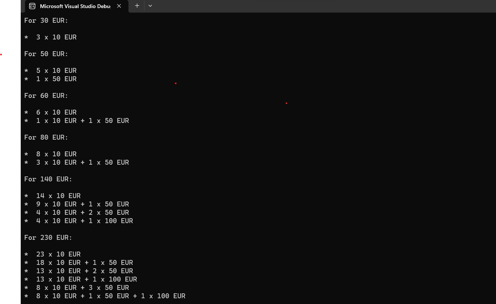

# All combinations for an amount using 10, 50, 100 EUR cartridges.

- This program displays all the combinations for an amount by just using 10, 50 & 100 EUR cartridges.
- This program has 2 methods:
  - CalculateCombinations - Which calculates all the possible combinations.
  - PrintCombination(List(int) combination) - Which prints all the combinations for a specific amount.

  